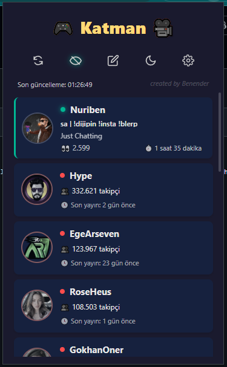

# 🎮 Katman Yayıncı Takibi Chrome Eklentisi

Bu eklenti, [Katman] ekibindeki yayıncıların Kick.com üzerindeki canlı yayın durumlarını takip etmeyi, yayın başladığında bildirim almayı ve Kick.com sitesi üzerinde çeşitli kullanıcı deneyimi iyileştirmeleri yapmayı amaçlayan bir Chrome eklentisidir.

## ✨ Özellikler

- **Canlı Yayın Takibi:** Anlık olarak hangi yayıncının yayında olduğunu, izleyici sayısını ve yayın süresini gösterir.
- **Anlık Bildirimler:** Takip ettiğiniz bir yayıncı yayına başladığında masaüstü bildirimi gönderir.
- **Kişiselleştirme:**
    - Çevrimdışı yayıncıları gizleme/gösterme.
    - İstediğiniz yayıncı için bildirimleri açıp kapatma.
    - İstenmeyen yayıncıları listeden tamamen gizleme ve gizlenenleri yönetme.
    - Açık ve Koyu tema desteği.
- **Site İyileştirmeleri (Kick.com üzerinde çalışır):**
    - **Otomatik Sidebar Küçültme:** Sayfa açıldığında soldaki menüyü otomatik olarak küçültür.
    - **1080p Kalite Zorlama:** Mümkünse yayın kalitesini otomatik olarak 1080p'ye ayarlar.
    - **Host Engelleme:** Bir kanal başka bir kanalı host ediyorsa videoyu gizleyerek uyarır.
- **Ayarlar Menüsü:** Tüm site içi özellikleri eklenti üzerinden açıp kapatabilme.

## 🛠️ Kurulum

Eklenti şu an Chrome Web Mağazası'nda bulunmamaktadır. Manuel olarak kurmak için:

1.  Bu deponun en son sürümünü [Releases](https://github.com/EnderKorkmaz/Katman-Yayinci-Takibi) sayfasından ZIP olarak indirin veya depoyu klonlayın.
2.  İndirdiğiniz ZIP dosyasını bir klasöre çıkartın.
3.  Chrome'u açın ve adres çubuğuna `chrome://extensions` yazın.
4.  Sağ üst köşedeki **"Geliştirici modu" (Developer mode)** anahtarını aktif hale getirin.
5.  Sol üstte beliren **"Paketlenmemiş öğe yükle" (Load unpacked)** butonuna tıklayın.
6.  Açılan pencerede, 2. adımda dosyaları çıkarttığınız klasörü seçin.
7.  Eklenti kurulmuş ve tarayıcınızın sağ üst köşesinde belirecektir.

## 🚀 Kullanılan Teknolojiler

-   HTML5
-   CSS3
-   JavaScript (ES6+)
-   Chrome Extension Manifest V3 API

## 💖 Destek ve Geliştirme

Projeyi geliştiren: **Benender** ([Instagram](https://instagram.com/enderkorkmaz.z))

Geliştirmelere katkıda bulunmak isterseniz "pull request" gönderebilirsiniz.

## 📄 Lisans

Bu proje [MIT Lisansı](./LICENSE) ile lisanslanmıştır.
